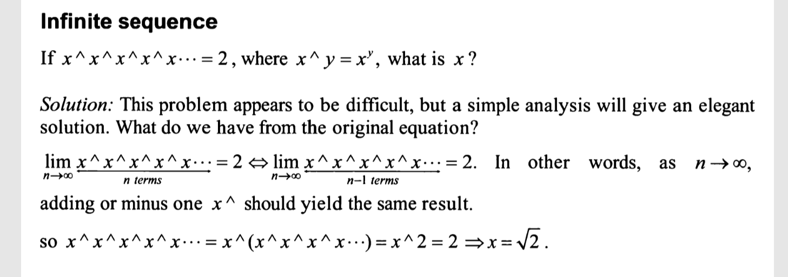

If x ^ x ^ x ^ x ^ x ^ x... = 2, where x ^ y = x * x (y times), what is x?

idea:
x = 1 -> 1  = 1  = 1
x = 2 -> 2 ^ 2 = 4
x = 3 -> 3 ^ 3 ^ 3 = 27 ^ 3 = 19683

must be a number between [1,2]

Solution: 
please refer to attached screenshot
