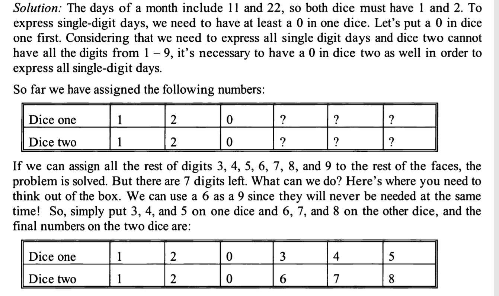

You have 2 dice custom-made
you place single digit numbers on the faces of each dice so that you can arrange to dice in a way as to make the two 
front faces show the current day of the month.
You must use both dice (in other words, days 1- 9 should be 01-09), but you can switch the order of the dice if you want.
What numbers do you have to put on the six-faces of each of the two dice to achieve that?

idea & solution:
01 - 09      01,02,03,04,05      D2 -> 0,1,2,3,4,5
             60,70,80,90         D1 -> 0,6,7,8,1,2 (tricky point is 6 can be used as 9, otherwise D2 always needs a 9)

both needs 0,1,2 to stand for 11,22 and 0 needed by both because 1-9 cannot be represented with single dice with 0 
         
10-19       11,12,13,14,15       D2 -> 0-5 ok
            61,71,81,91          D1 -> 0,7,8,6,1
20-29                            D2 -> 0-5 ok
                                 D1 -> 0,6,7,8,1,2
30,31  D1,D2 can handle

so
D1: 0,7,8,[6],1,2
D2: 0,1,2,3,4,5

The whole point of thinking out of box is to use 6 to represent 9 since 6 and 9 will never come together as a day of 
month and they are looking the same (i.e. custom-made)

More details:

                                 
                                 
            