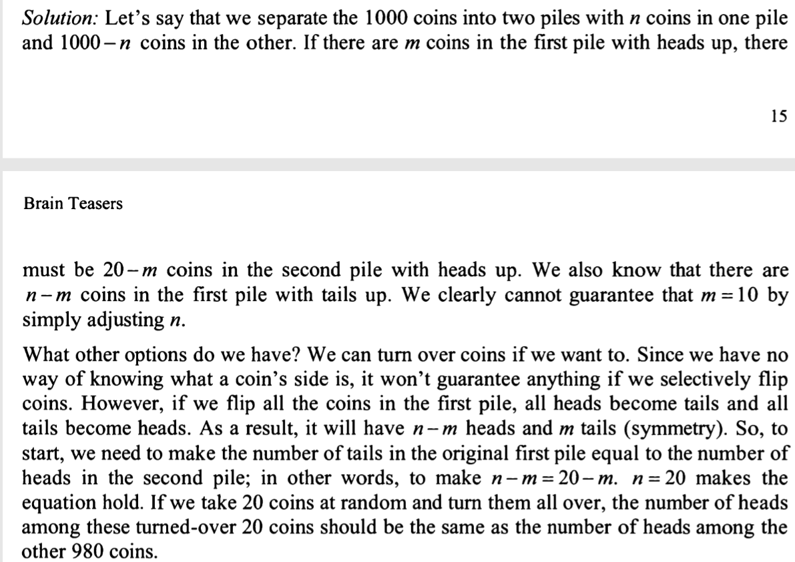

you are blind folder in a room and there are 1000 coins
980 tails up and 20 heads up

Can you separate the coins into 2 piles so to guarantee both have equal number of heads?
Assume you cannot tell coin's side by touching it, but you are allowed to turn over any number of coins.

idea:
think simple:
100 coins, 98 tails up, 2 heads up
if divide into 2 piles without any turn overs:

1 : 1
2 : 0
give up, no idea

Solution:

review:
turn over is the key hint here, by turn over all in one pile ensure the symmetry swap of tail and head numbers.
