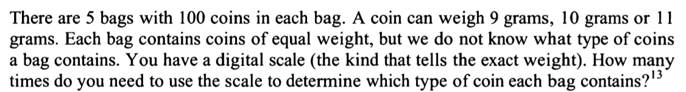
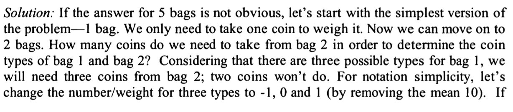
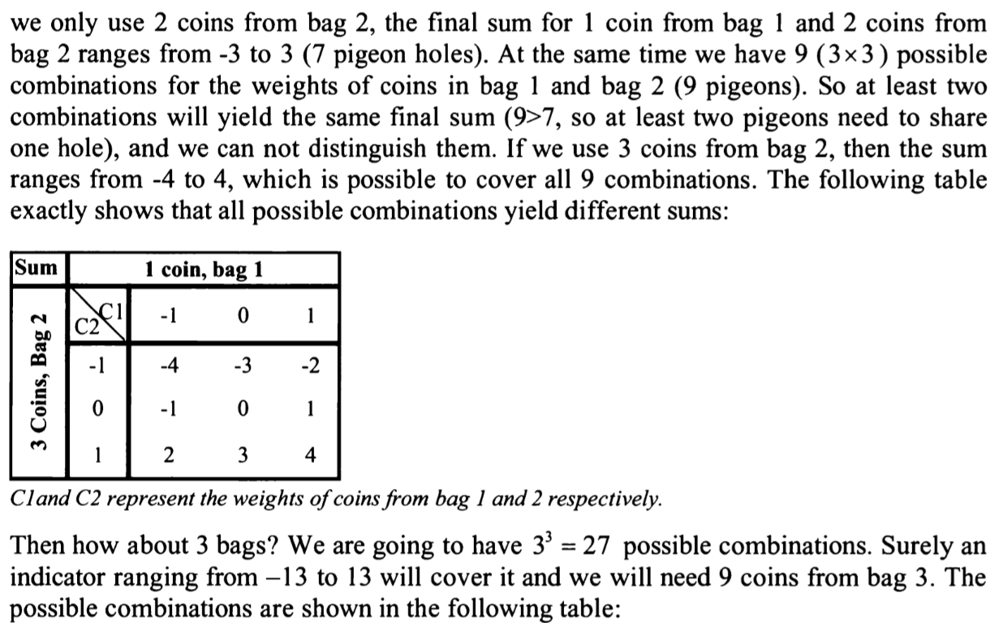
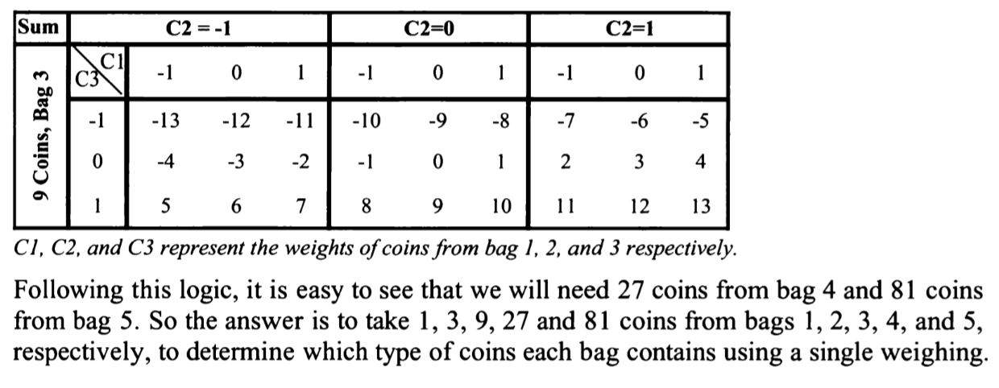

idea:
b1 b2 b3 b4 b5
1  2  3  4  5 coins

3 holes: 9,10,11
5 pigeons

n = 3
nm+1 = 5 -> m>1 
then m+1 > 2
meaning at least 2 bags sharing same weights of coins

now think simple, 
max 5 times, one coin from each bag

is there a way I can mini times of weighing?
dif number of coins from each bag.

Solution:

review:
hard to think but can understand, my idea was not in correct direction.
