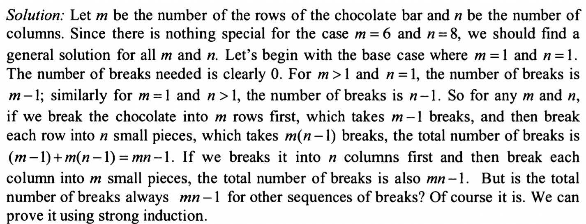
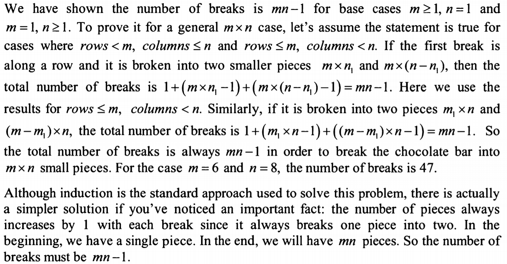

a chocolate bar has 6 rows and 8 columns (48 small 1x1). you break it into individual squares by making a number of 
breaks. each time, break one rectangle into two smaller rectangles. i.e. in first step you can break 6x8 into 6x3 and 6x5
what is the total number of breaks needed in order to break the chocolate bar into 48 small squares?

idea:
f(1*1) = 0
f(2*1) = 1
f(3*1) = 2
f(4*1) = 3

f(2*2) = 3
f(3*2) = 5
f(3*3) = 8
...
f(a*b) = (a-1) + a(b-1) = ab-1

therefore f(8x6) = 48-1 = 47

Solution: 
pretty much same to my idea
  

