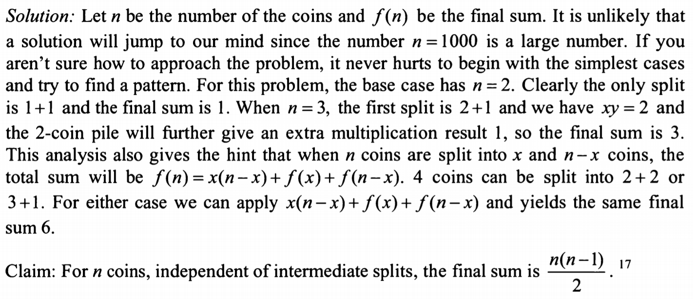
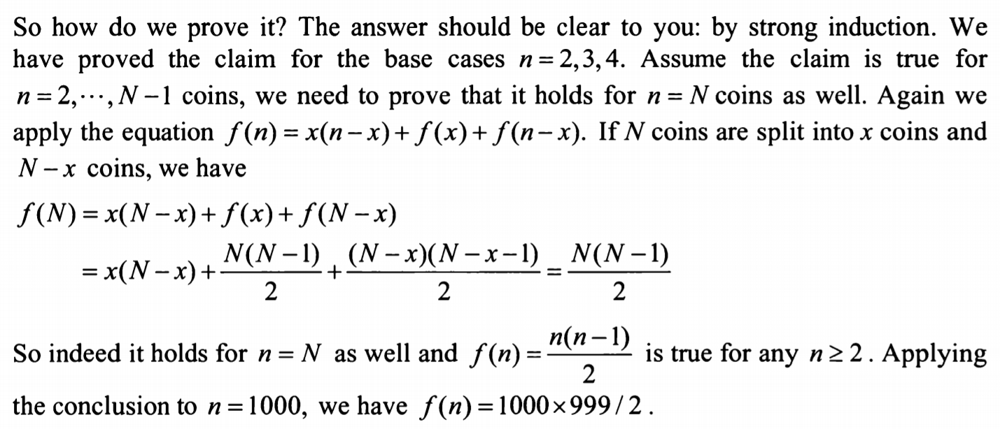

you split 1000 coins into 2 piles and count the number of coins in each pile
if there are x coins in pile one and y coins in pile two. you x*y to get xy.
then you split both piles further repeat the same counting and multiplication process
and add the new multiplication results to the original.
i.e. you split x to x1 and x2, y to y1 and y2. then the sum is xy + x1x2 + y1y2
the process is repeated until you only have piles of 1 stone each. what is the final sum?
(the final 1's are not included in the sum.) prove that you always get the same answer no matter how the piles are divided.

idea:
total = 2
x=1 y=1 sum=1
p(2) = 1

total = 3
x=2 y=1, sum=3
p(3) = 3

total = 4
x=2 y=2, sum=6
x=1 y=3, sum=6
p(4) = 6

total=5
x=3 y=2 sum = 8
p(5) = 8

total=6
x=3 y=3 sum = 13
p(6) = 13

p(n) = x(n-x) + p(x) + p(n-x)

for n coins, independent of intermediate splits, the final sum is n(n-1)/2

Solution:

review:
my idea was ok but what I missed is to work out the exact sum = n(n-1)/2 and also f(n) = n(n-x) + f(x) + f(n-x) 

