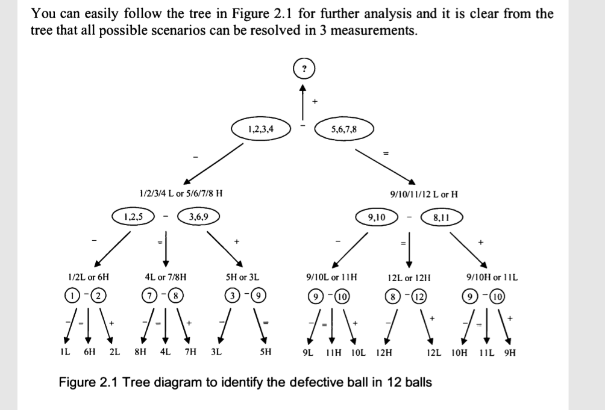

12 identical balls
1 is heavier Or lighter than the rest (i dont know)
using just a balance that can only show you which side of tray is heavier

How can you determine which ball is the defective one with 3 measurements?

Idea:
5 + 5 on balance:
if balanced, one more time on 1 + 1
if not, 2 + 2 on balance: -> [this is wrong because we dont know the defective side is lighter or heavier]
    if balanced, the remaining 1 is dif
    if not, one more time 1 + 1
    
This works as well:    
6 + 6
3 + 3
1 + 1

Above is WRONG! because I didnt consider the defective ball can be either heavier or lighter

Solution:
The key is to split into 3 instead of groups
reason is the comparison of 2 groups give info about the third group

please refer to attached screenshot

