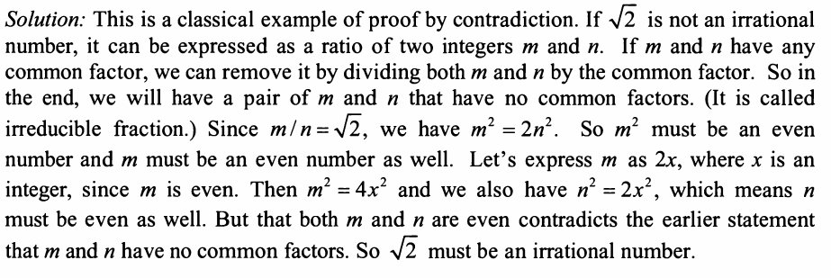

can you prove √2 is irrational number? A rational number is a number that can be expressed as a ratio of two integers.
otherwise it is irrational.

idea:
think from opposite: if √2 can be expressed by a/b
then 
2 = a^2 / b^2
it means 2 * b * b = a * a
if a b are integers, then b*b must be 2 then b can never be integer, so it proves √2 is irrational number

Solution:

review: 
the angle of solution is based on check even
