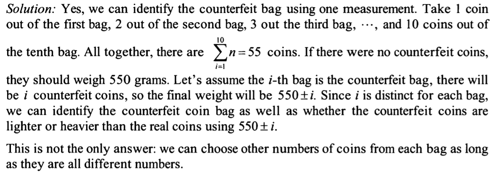

10 bags with 100 identical coins in each bag.
in all bags but one, each coin weighs 10 grams. however all the coins in the counterfeit bag weigh either 9 or 11 grams.

Can you find the counterfeit bag in only one weighting, using a digital scale that tells the exact weight?

Idea:
take 1 coin from each bag
c1 from b1, c2 from b2 ... c10 from b10
no way that gurantee 1 weighing can work out.

so thinking from taking dif nums of coins from each bag:
1 from b1, 2 from b2, 3 from b3 ... 10 from b10

so I can weigh all of them and can tell which exactly bag containing wrong coins.
i.e. since all fake coins are all either 9 or 11 and the number of coins from each bag is different.

review: correct!

Solution:
pretty much same:

