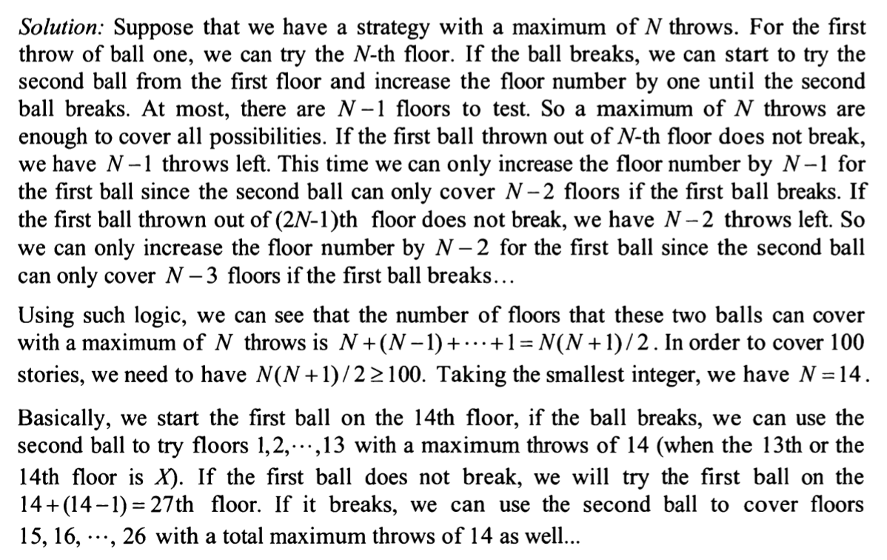

you are holding 2 glass balls in a 100-story building, if a ball is thrown out of the window it will not break if the 
floor number is < X, and it will always break if >= X 
You would like to determine X. 
What is the strategy that will minimize the number of drops for the worst case scenario?

Idea:
binary pick? 50/25/12/6 or 50/75/87/93 etc 
if lets say not break at 50, go to 75 and it breaks.
then (50,75) we can binary pick to find 

review:
Can understand answer but dont think this is a good question as its misleading. 
