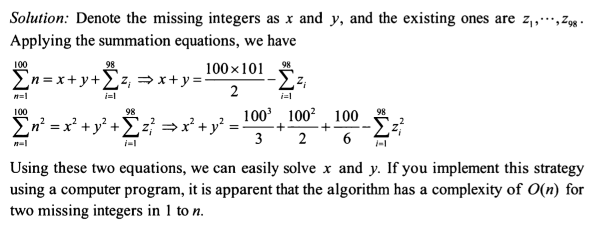

Suppose we have 98 distinct integers from 1 to 100
whats a good way to find out the 2 missing integers [1,100] ?

idea:
thinking about series summation, we can add all and use sum of 1-100 to deduct and start from permutation to check.
i.e. suppose 45 and 73 are missing
then 5050 - sum of random, which will be 4932
then the number is 118

start from 18 100 / 19 99 / ... / 45 73 found the pair.

Solutoin:
apply summation equations:

review:
takeaway here is to apply formula on square and also normal summation equations