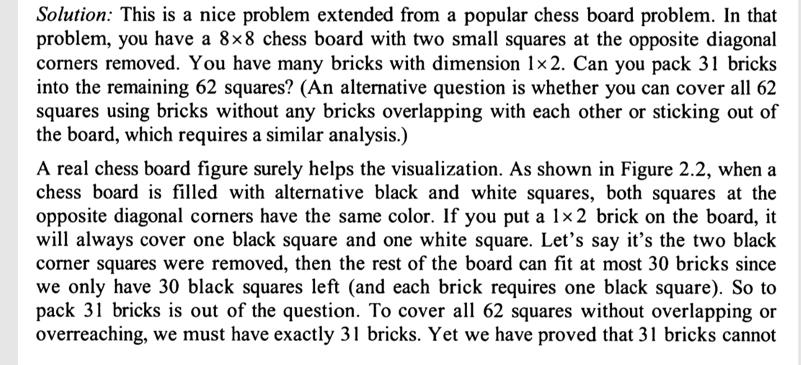
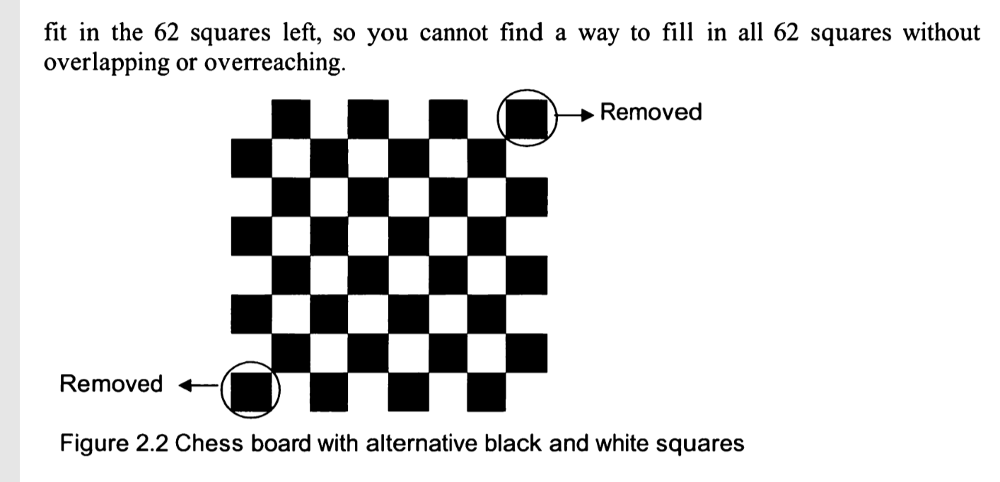

Can you pack 53 bricks of dimensions 1 * 1 * 4 into a 6 * 6 * 6 box?

idea:
36 at bottom that's making 6 6 4 space
now
53-36=17 to fill 6 6 2

then I cannot seem find a way out, there is always 4 cells left for the remaning 2 layers
even if we drop the idea vertically place all to take up 6 6 4

Actually,
0 1 1 1 1 0
1 1 1 1 1 1
1 1 1 1 1 1
1 1 1 1 1 1
1 1 1 1 1 1
0 1 1 1 1 0
Still no way out to me.

Solution:
this is a prob exteded from chess board prob. 
i.e. 8 * 8 board with 2 small squares at the opposite diagonal corners (duixiao xian) removed.
you have 1 * 2 many bricks can you pack 31 bricks into the remaining 62 squares?

Another way to ask: can you cover all 62 quares using bricks without any bricks overlapping or sticking out of board.

