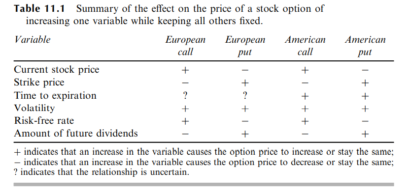

Properties of Stock Options

There are six factors affecting the price of a stock option:
1. The current stock price, S0
2. The strike price, K
3. The time to expiration, T
4. The volatility of the stock price, 
5. The risk-free interest rate, r
6. The dividends that are expected to be paid

part 3 notes from course video: 
Call option:
if St > K => St
if St < K => K

Put option:
if St > K => St
if St < K => K

therefore, Value T = Max(St,K)
No Arbitrage chance as present values are identical

Put-Call Parity:
Ce + Ke^-rT = S0 + Pe

the above formula we can determine option prices given one price of option
i.e. 
S0=31
K=30
r=10%
T=3month
Ce=3

3 + 30e^(0.1*0.25) = 31 + Pe

Pe = 1.26

Ce - Pe = S0 - Ke^-rT (which present value is constant)
Δ(Ce - Pe) = ΔS0
ΔCe - ΔPe = ΔS0

when S0 +, then Ce +, Pe-
  +       -       +
  -       +       -
|ΔCe| + |ΔPe| = |ΔS0|
ΔCe - ΔPe = ΔS0
hence:
Long call + Short put = S0 (called Synthetic long)
short call + long put = -S0 (called Synthetic short)

it doesnt matter what K you choose, always S0 holds.

Now turn to American Options:

Δ[Ca + Pa] >= somewhat equal or slightly greater than ΔS0

1.01-1.04 = 1

so you cannot determine the other option price, but instead detecting a range.
Still it is useful enough to create a synthetic positions.

S0=50
K=50
T=6months

Ca ~= Pa (K close to S0 and pay nothing to create below)
(-$)  (+$)   -> net zero cashflow position

hence levering up by using put-call parity, you can long or short the equity.

  

