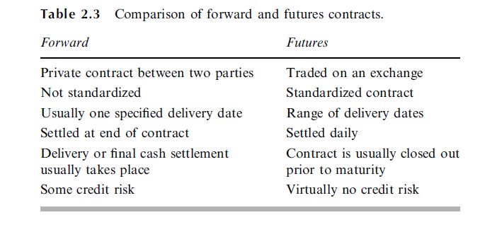

# Mechanics of Future markets
exchange traded

              clearing house
Buyer -long -> [Contract] <-short- Seller
                |
                V
                Asset => grade allowed at some price
                contract size: depends on the asset: i.e. NG-10k CL-1k, ZC-5k, stock-100 shares
                delivery specifications: i.e. location
                time: month of contract != contract expiration: i.e. deliver in Oct, contract expires in Sep
                
                
Price increments: i.e. CL-penny, NG-1/10 cent

Limit up / limit down: no trades can occur outside these limits.
trading will pause until it falls back into the limits range.
trading will resume when within the limits range.

###Margin requirements:
If two investors get in touch with each other directly and agree to trade an asset in the
future for a certain price, there are obvious risks. One of the investors may regret the
deal and try to back out. Alternatively, the investor simply may not have the financial
resources to honor the agreement. One of the key roles of the exchange is to organize
trading so that contract defaults are avoided. This is where margin accounts come in.

###Credit Risk
 The whole purpose of the margining system is to ensure that funds are available to pay
 traders when they make a profit.
 
What Is Credit Risk?
Credit risk is the possibility of a loss resulting from a borrower's failure to repay a loan or meet contractual 
obligations. Traditionally, it refers to the risk that a lender may not receive the owed principal and interest, which 
results in an interruption of cash flows and increased costs for collection. Excess cash flows may be written to provide 
additional cover for credit risk. When a lender faces heightened credit risk, it can be mitigated via a higher coupon 
rate, which provides for greater cash flows.

https://www.investopedia.com/terms/c/creditrisk.asp#:~:text=Credit%20risk%20is%20the%20possibility,and%20increased%20costs%20for%20collection.

###Market quotes:
- Prices
- Settlement price
- Trading Volume (volume of trades on that day) and Open Interest (sum of all contracts still open on that day)
- Patterns of Futures:
    - normal market: gold, wheat, and live cattle settlement futures prices are an increasing function of the maturity 
                     of the contract. This is known as a normal market. The situation where settlement futures
                     prices decline with maturity is referred as an inverted market Commodities such as
                     crude oil, corn, and soybeans showed patterns that were partly normal and partly
                     inverted on May 14, 2013.
    - inverted market:
    - partly normal and partly inverted market

###TYPES OF TRADERS AND TYPES OF ORDERS
####Type of traders:
1. FCMs: futures commission merchants: FCMs are following the instructions of their clients and charge a
                                       commission for doing so
2. locals: locals are trading on their own account

##### Types of Speculators:
* scalpers: 
are watching for very short-term trends and attempt to profit from small changes in the contract price. 
They usually hold their positions for only a few minutes
* day traders
hold their positions for less than one trading day. They are unwilling to take the risk that adverse news will
occur overnight.
* arbitrageurs 
hold their positions for much longer periods of time. hey hope to make significant profits from major movements 
in the markets.

####Orders:
- market order: It is a request that a trade be carried out immediately at the best price available in the market.
- limit order: specifies a particular price. The order can be executed only at this price or at 
                one more favorable to the investor.
- stop order or *stop-loss*: Suppose a stop order to sell at $30 is issued when the market price
                             is $35. It becomes an order to sell when and if the price falls to $30. In effect, a stop
                             order becomes a market order as soon as the specified price has been hit.

- stop-limit order: a combination of a stop order and a limit order. 
Two prices must be specified in a stop–limit order: the stop price and 
the limit price. Suppose that at the time the market price is $35, a stop–limit
order to buy is issued with a stop price of $40 and a limit price of $41. As soon as there is
a bid or offer at $40, the stop–limit becomes a limit order at $41. If the stop price and the
limit price are the same, the order is sometimes called a *stop-and-limit order*.

- market-if-touched (MIT) order: is executed at the best available price after a trade occurs at a specified price or 
at a price more favorable than the specified price. In effect, an MIT becomes a market order once the specified price 
has been hit. An MIT is also known as a board order. Consider an investor who has a long position in a futures
contract and is issuing instructions that would lead to closing out the contract. A stop
order is designed to place a limit on the loss that can occur in the event of unfavorable
Mechanics of Futures Markets price movements. By contrast, a market-if-touched order is designed to ensure that
profits are taken if sufficiently favorable price movements occur.

- discretionary order or *market-not-held order*: traded as a market order except that execution may be delayed at the 
broker’s discretion in an attempt to get a better price.

### Regulation
- corner the market
- front running
refer to books for the actual case examples

### Accounting the Tax

### FORWARD vs. FUTURES CONTRACTS
- forward in OTC market 
- future in exchange traded market and daily settled. Often closed out prior to maturity.

#### Foreign exchange quotes

futures prices where one currency is the US dollar are always
quoted as the number of US dollars per unit of the foreign currency or as the number
of US cents per unit of the foreign currency. Forward prices are always quoted in the
same way as spot prices. This means that, for the British pound, the euro, the
Australian dollar, and the New Zealand dollar, the forward quotes show the number
of US dollars per unit of the foreign currency and are directly comparable with futures
quotes. For other major currencies, forward quotes show the number of units of the
foreign currency per US dollar (USD). Consider the Canadian dollar (CAD). A
futures price quote of 0.9500 USD per CAD corresponds to a forward price quote
of 1.0526 CAD per USD (1:0526 ¼ 1=0:9500).

