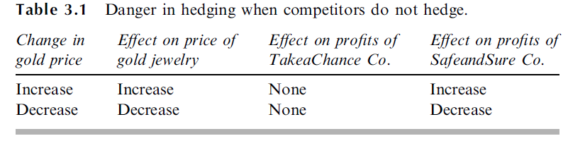
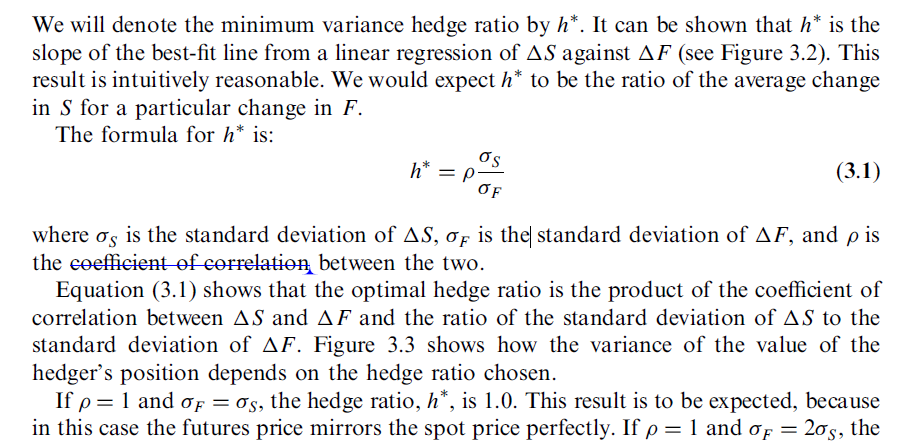
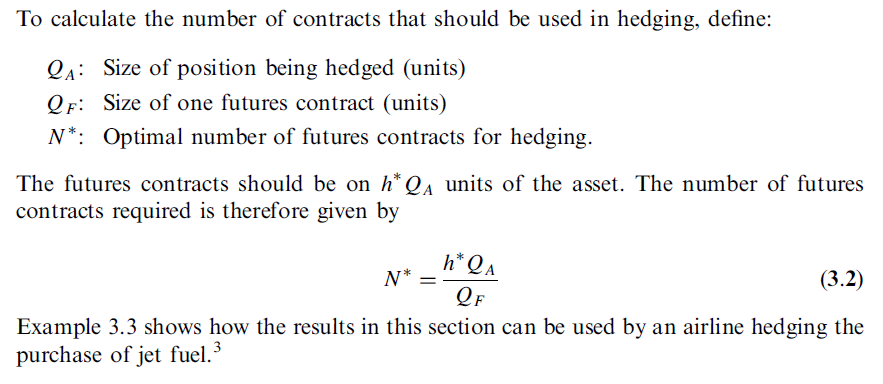
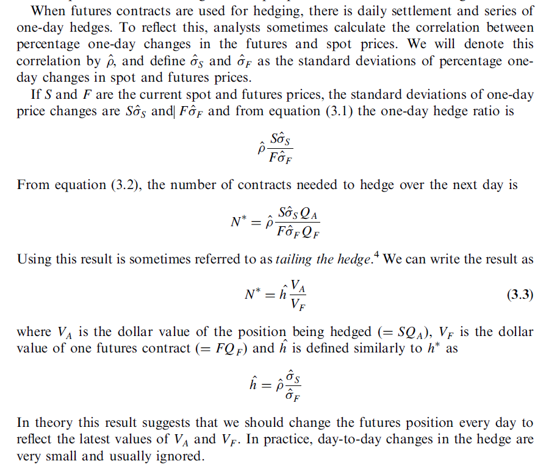
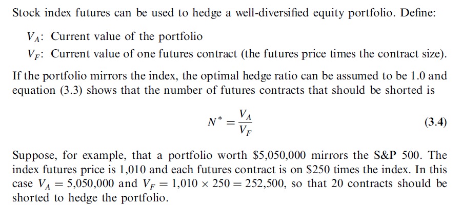
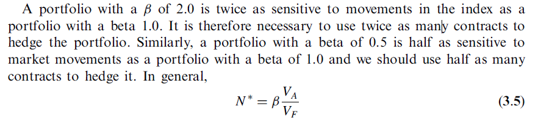
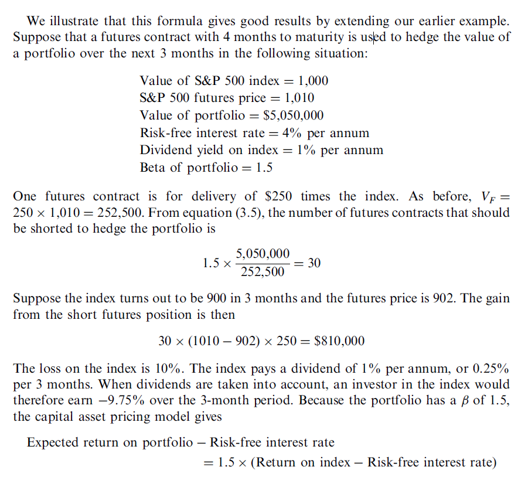
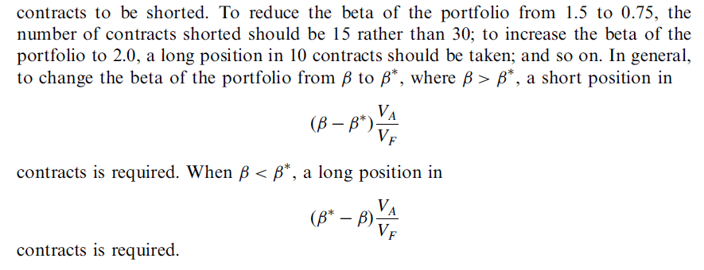

Many of the participants in futures markets are hedgers. Their aim is to use futures
markets to reduce a particular risk that they face. This risk might relate to fluctuations
in the price of oil, a foreign exchange rate, the level of the stock market, or some other
variable. A perfect hedge is one that completely eliminates the risk. Perfect hedges are
rare. For the most part, therefore, a study of hedging using futures contracts is a study
of the ways in which hedges can be constructed so that they perform as close to perfect
as possible.


### Basic Principles
When an individual or company chooses to use futures markets to hedge a risk, the
objective is usually to take a position that neutralizes the risk as far as possible.
#### Short Hedges
A short hedge is a hedge, such as the one just described, that involves a short position in
futures contracts. A short hedge is appropriate when the hedger already owns an asset
and expects to sell it at some time in the future

basics: short meaning: short selling is opening a position indicating selling it first (borrowing from broker first) 
and pay back later hoping the price goes down when buy back. 
#### Long Hedges
A long hedge is appropriate when a company knows it will have to purchase a
certain asset in the future and wants to lock in a price now.

### Arguments for and against hedging
- for nonfinancial companies, make sense for hedging as they have no particular skills in predicting interest rates, 
exchange rate or commodity prices.

#### Hedging and Shareholders
One argument sometimes put forward is that the shareholders can, if they wish, do the
hedging themselves. They do not need the company to do it for them. This argument is,
however, open to question. It assumes that shareholders have as much information as the
company’s management about the risks faced by a company. In most instances, this is
not the case.
One thing that shareholders can do far more easily than a corporation is diversify
risk.

#### Hedging and Competitors
Competitive pressures
within the industry may be such that the prices of the goods and services produced by
the industry fluctuate to reflect raw material costs, interest rates, exchange rates, and so
on. A company that does not hedge can expect its profit margins to be roughly
constant. However, a company that does hedge can expect its profit margins to
fluctuate!



The example emphasizes the importance of looking at the big picture when hedging.
All the implications of price changes on a company’s profitability should be taken into
account in the design of a hedging strategy to protect against the price changes.

#### hedging can lead to a worse outcome
Mostly refer to when short and price goes up, your profit limited.
When long and price goes down, your profit limited.

###Basis Risk
In practice, hedging is often not quite as
straightforward as this. Some of the reasons are as follows:
1. The asset whose price is to be hedged may not be exactly the same as the asset
underlying the futures contract.
2. The hedger may be uncertain as to the exact date when the asset will be bought
or sold.
3. The hedge may require the futures contract to be closed out before its delivery
month.

The basis in a hedging situation is as folows:
```
Basis = Spot price of asset to be hedged - Futures price of contract used
```

Note that basis changes can lead to an improvement or a worsening of a hedger’s
position. Consider a company that uses a short hedge because it plans to sell the
underlying asset. If the basis strengthens (i.e., increases) unexpectedly, the company’s
position improves because it will get a higher price for the asset after futures gains or
losses are considered; if the basis weakens (i.e., decreases) unexpectedly, the company’s
position worsens. For a company using a long hedge because it plans to buy the asset,
the reverse holds. If the basis strengthens unexpectedly, the company’s position worsens
because it will pay a higher price for the asset after futures gains or losses are
considered; if the basis weakens unexpectedly, the company’s position improves.


*cross hedging*: The asset that gives rise to the hedger’s exposure is sometimes different from the
asset underlying the futures contract that is used for hedging. This is known as *cross
hedging*

#### Choice of contract
This choice has two components:
1. The choice of the asset underlying the futures contract
2. The choice of the delivery month.

### Cross hedging
Cross hedging occurs when the two assets are different.
for example, an airline that is concerned about the future price
of jet fuel. Because jet fuel futures are not actively traded, it might choose to use heating
oil futures contracts to hedge its exposure.


The *hedge ratio* is the ratio of the size of the position taken in futures contracts to the
size of the exposure

#### Calculating the Minimum Variance Hedge Ratio
ΔS: Change in spot price, S, during a period of time equal to the life of the hedge
ΔF: Change in futures price, F, during a period of time equal to the life of the
hedge.



#### Optimal Number of Contracts



####Tailing the Hedge


### Stock Index Futures
####Hedging an Equity Portfolio


####capital asset pricing model

When the portfolio does not mirror the index, we can use the capital asset pricing
model (see the appendix to this chapter). The parameter beta () from the capital
asset pricing model is the slope of the best-fit line obtained when excess return on the
portfolio over the risk-free rate is regressed against the excess return of the index over
the risk-free rate. When  ¼ 1:0, the return on the portfolio tends to mirror the return
on the index; when  ¼ 2:0, the excess return on the portfolio tends to be twice as
great as the excess return on the index; when  ¼ 0:5, it tends to be half as great; and
so on.






The risk-free interest rate is approximately 1% per 3 months. It follows that the expected
return (%) on the portfolio during the 3 months when the 3-month return on the index

is -9.75% is
1.0 + (1.5 * (-9.75 - 1:0)) = -15:125
The expected value of the portfolio (inclusive of dividends) at the end of the 3 months is
therefore
$5,050,000 * (1 - 0:15125) = $4,286,187
It follows that the expected value of the hedger’s position, including the gain on the
hedge, is
$4,286,187 + $810,000 = $5,096,187

###Reasons for Hedging an Equity Portfolio
- hedging can be justified if the hedger feels that the stocks in the portfolio 
have been chosen well. In these circumstances, the hedger
might be very uncertain about the performance of the market as a whole, but
confident that the stocks in the portfolio will outperform the market (after appropriate
adjustments have been made for the beta of the portfolio). A hedge using index futures
removes the risk arising from market moves and leaves the hedger exposed only to the
performance of the portfolio relative to the market. 
- Another reason for hedging may be that the hedger is planning to hold a
portfolio for a long period of time and requires __short-term protection__ in an uncertain
market situation. The alternative strategy of selling the portfolio and buying it back
later might involve unacceptably high transaction costs.

###Changing the Beta of a Portfolio
####Def from online:  https://www.investopedia.com/terms/c/capm.asp
The beta of a potential investment is a measure of how much risk the investment will add to a portfolio 
that looks like the market. If a stock is riskier than the market, it will have a beta greater than one. If a stock has 
a beta of less than one, the formula assumes it will reduce the risk of a portfolio.

sometimes futures contracts are used to change the beta of a portfolio to some value other than zero.
i.e. continue with previous example:

250 * 1010=252,500

1.5 * (5,050,000 / 252,500) = 30


####Locking in the Benefits of Stock Picking
- if a stock you picked and you are confident it outperforms market:i.e. 
The investor feels that the market will be very volatile over the next three months but that
the company has a good chance of outperforming the market. The investor decides to use
the August futures contract on the S&P 500 to hedge the market’s return during the three month period. 

###Stack and Roll
Sometimes the expiration date of the hedge is later than the delivery dates of all the
futures contracts that can be used. The hedger must then roll the hedge forward by
closing out one futures contract and taking the same position in a futures contract with
a later delivery date. Hedges can be rolled forward many times. The procedure is known
as stack and roll.
refer more to books for more examples.

### Summary

This chapter has discussed various ways in which a company can take a position in
futures contracts to offset an exposure to the price of an asset. 
- If the exposure is such that the company gains when the price of the asset increases and loses when the price of
the asset decreases, a short hedge is appropriate. 
- If the exposure is the other way round
(i.e., the company gains when the price of the asset decreases and loses when the price
of the asset increases), a long hedge is appropriate.

- basis risk: the difference between the spot price of an asset and its futures price
- hedge ratio
- Stock index futures: can be used to hedge the systematic risk in an equity portfolio
- Stack and roll

              


