# Interest Rates
### Types of Rates
These include mortgage rates, deposit rates, prime borrowing
rates, and so on

The higher the credit risk, the
higher the interest rate that is promised by the borrower.

Interest rates are often expressed in basis points. One basis point is 0.01% per annum.

#### Treasury Rates
Treasury rates are the rates an investor earns on Treasury bills and Treasury bonds.
These are the instruments used by a government to borrow in its own currency.

It is usually assumed that there is no chance that a government will default
on an obligation denominated in its own currency. Treasury rates are therefore totally
risk-free rates in the sense that an investor who buys a Treasury bill or Treasury bond is
certain that interest and principal payments will be made as promised.

####LIBOR
LIBOR is short for *London Interbank Offered Rate*

LIBOR rates are published by the British Bankers Association (BBA) at
11:30 a.m. (UK time). The BBA asks a number of different banks to provide quotes
estimating the rate of interest at which they could borrow funds just prior to 11:00 a.m.
(UK time). The top quarter and bottom quarter of the quotes for each currency/
borrowing-period combination are discarded and the remaining ones are averaged to
determine the LIBOR fixings for a day

####The Fed Funds Rate
In the United States, the overnight rate is called the *federal funds rate*.
For example, in the UK the average of
brokered overnight rates is termed the sterling overnight index average (SONIA) and, in
the euro zone, it is termed the euro overnight index average (EONIA).

Both LIBOR and the federal funds rate are unsecured borrowing rates. On average,
overnight LIBOR has been about 6 basis points (0.06%) higher than the effective
federal funds rate except for the tumultuous period from August 2007 to December
2008. The observed differences between the rates can be attributed to timing effects, the
composition of the pool of borrowers in London as compared to New York, and
differences between the settlement mechanisms in London and New York.

####Repo Rates
Unlike LIBOR and federal funds rates, repo rates are secured borrowing rates.
*Repo rate*: 
In a repo
(or repurchase agreement), a financial institution that owns securities agrees to sell the
securities for a certain price and buy them back at a later time for a slightly higher
price. The financial institution is obtaining a loan and the interest it pays is the
difference between the price at which the securities are sold and the price at which
they are repurchased. The interest rate is referred to as the repo rate.

*overnight repo*
*term repos* for longer term arrangements

####The ‘‘Risk-Free’’ Rate
Derivatives are usually valued by setting up a riskless portfolio and arguing that the
return on the portfolio should be the risk-free interest rate. The risk-free interest rate
therefore plays a key role in the valuation of derivatives. For most of this book we will
refer to the ‘‘risk-free’’ rate without explicitly defining which rate we are referring to.
This is because derivatives practitioners use a number of different proxies for the riskfree
rate. Traditionally LIBOR has been used as the risk-free rate—even though LIBOR
is not risk-free because there is some small chance that a AA-rated financial institution
will default on a short-term loan. However, this is changing. In Chapter 9, we will
discuss the issues that practitioners currently consider when they choose the ‘‘risk-free’’
rate and some of the theoretical arguments that can be advanced.

###Measuring Interest Rates
compounding

####Continuous Compounding
The limit as the compounding frequency, m, tends to infinity is known as continuous
compounding. With continuous compounding, it can be shown that an amount A
invested for n years at rate R grows to

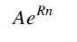

R is interest rate
n is num of years

- Compounding a sum of money at a continuously compounded rate
R for n years involves multiplying it by e^Rn. 
- Discounting it at a continuously compounded
rate R for n years involves multiplying by e^-Rn.

###Zero Rates
The n-year zero-coupon interest rate is
sometimes also referred to as the n-year *spot rate*, the n-year zero rate, or just the n-year zero

###Bond Pricing
Most bonds pay coupons to the holder periodically. The bond’s principal (which is also
known as its par value or face value) is paid at the end of its life.

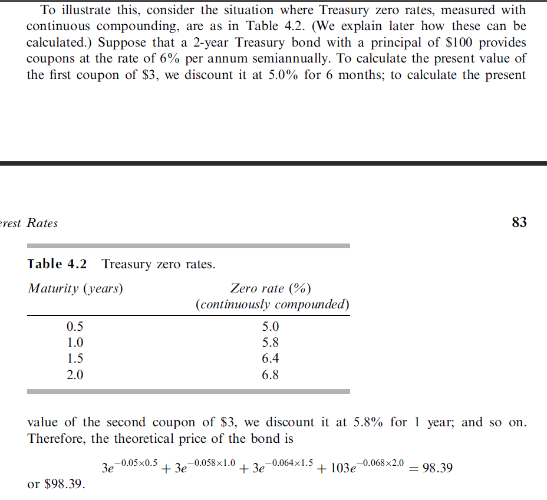

####Bond Yield
A bond’s yield is the single discount rate that, when applied to all cash flows, gives a
bond price equal to its market price. Suppose that the theoretical price of the bond we
have been considering, $98.39, is also its market value (i.e., the market’s price of the
bond is in exact agreement with the data in Table 4.2). If y is the yield on the bond,
expressed with continuous compounding, it must be true that

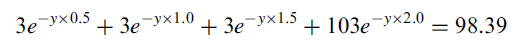
This equation can be solved using an iterative (‘‘trial and error’’) procedure to give
y ¼ 6:76%.

####Par Yield
The par yield for a certain bond maturity is the coupon rate that causes the bond price to
equal its par value. (The par value is the same as the principal value.)

Usually the bond is
assumed to provide semiannual coupons. Suppose that the coupon on a 2-year bond in
our example is c per annum (or 1
2c per 6 months). Using the zero rates in Table 4.2, the
value of the bond is equal to its par value of 100 when

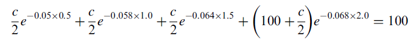
This equation can be solved in a straightforward way to give c ¼ 6:87. The 2-year par
yield is therefore 6.87% per annum. This has semiannual compounding because
payments are assumed to be made every 6 months. With continuous compounding,
the rate is 6.75% per annum.

More generally, 
- d: is the present value of $1 received at the maturity of the bond (discounting rate at maturity)
- A is the value of an annuity that pays one dollar on each coupon payment date
- m is the number of coupon payments per year, 
- then the par yield c must satisfy

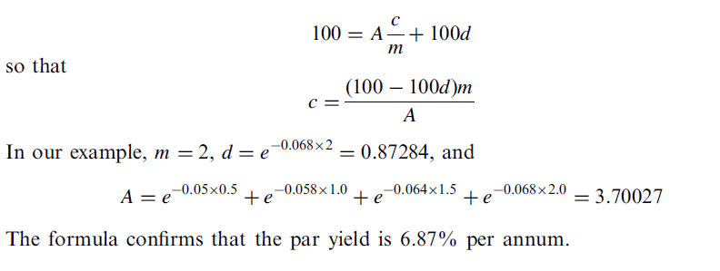

###DETERMINING TREASURY ZERO RATES
One way of determining Treasury zero rates such as those in Table 4.2 is to observe the
yields on ‘‘strips.’’ These are zero-coupon bonds that are synthetically created by traders
when they sell coupons on a Treasury bond separately from the principal.

Another way to determine Treasury zero rates is from Treasury bills and couponbearing
bonds. The most popular approach is known as the bootstrap method. To
illustrate the nature of the method, consider the data in Table 4.3 on the prices of five
bonds. Because the first three bonds pay no coupons, the zero rates corresponding to
the maturities of these bonds can easily be calculated. The 3-month bond has the effect
of turning an investment of 97.5 into 100 in 3 months. The continuously compounded
3-month rate R is therefore given by solving

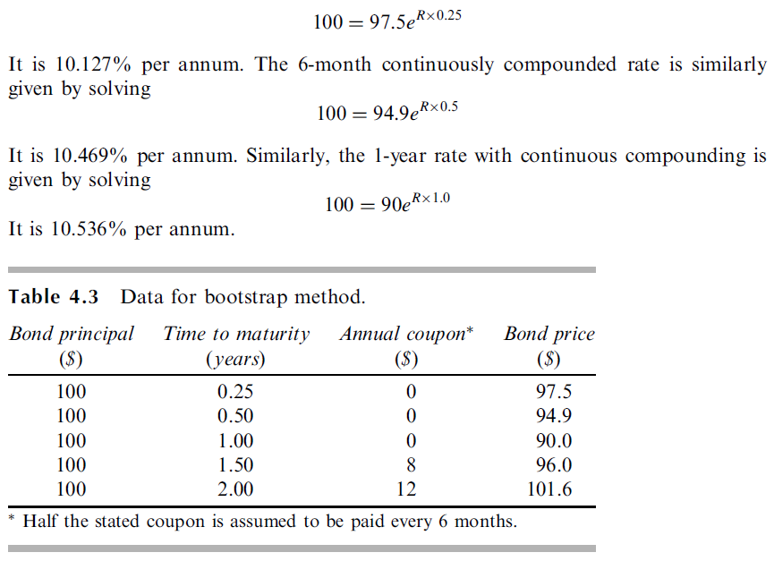
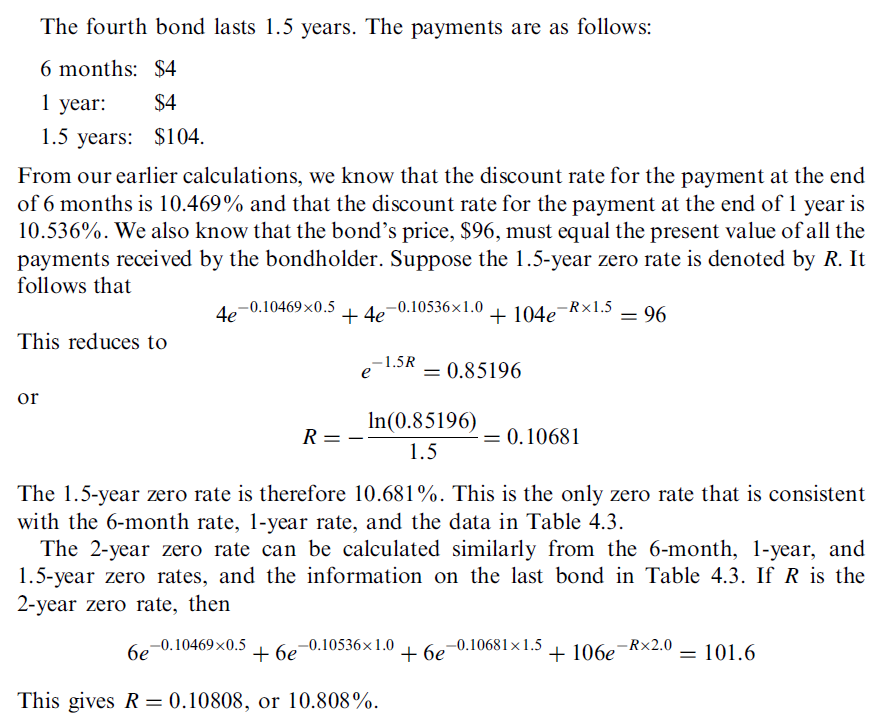

*zero curve*: A chart showing the zero rate as a function of maturity
A common assumption is that
the zero curve is linear between the points determined using the bootstrap method.

###FORWARD RATES
Forward interest rates are the future rates of interest implied by current zero rates for
periods of time in the future. 
The rates are assumed to be continuously compounded.

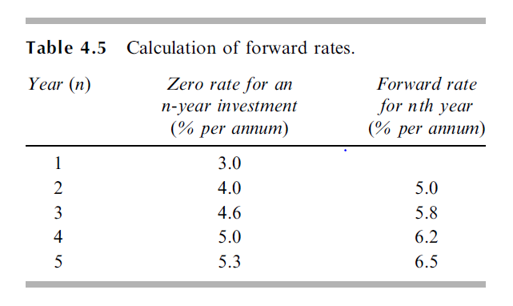
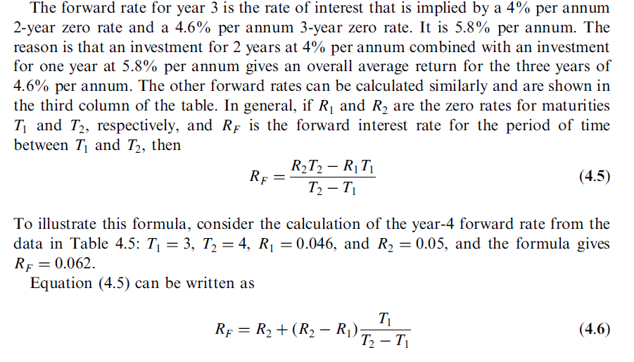
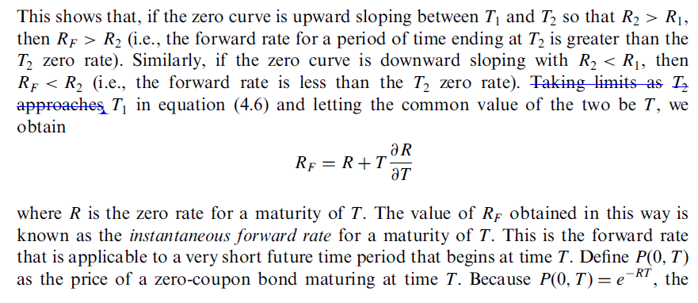
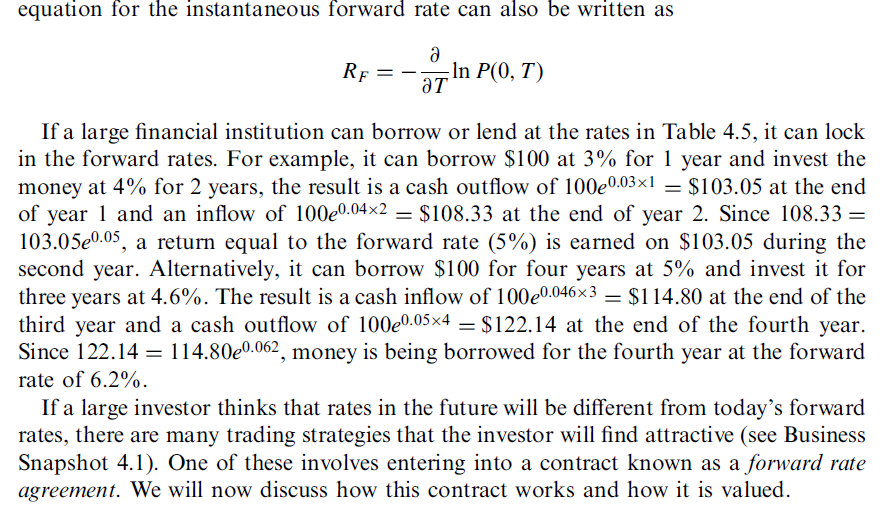

