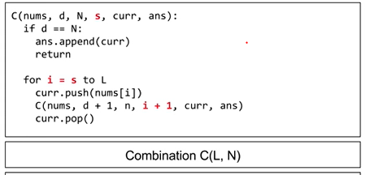

https://www.youtube.com/watch?v=DKCbsiDBN6c&list=PLDN4rrl48XKpZkf03iYFl-O29szjTrs_O&index=63&ab_channel=AbdulBari

What is backtracking?
backtracking is a brute force approach.
whereas DP is solving a optimisation problem.

- state space tree:
i.e. B1 B2 G1 (2 boys 1 girl)
three seats:[ | | ]
- bounding function: the condition to define the restriction logic 

Backtracking (DFS) VS. Branch and Bound (BFS)

Same template can be used:


```java

public class Combinations {
    public List<List<Integer>> combine(int n, int k) {
        List<List<Integer>> ans = new ArrayList<>();
        List<Integer> temp = new ArrayList<>();
        dfs(n, k, ans, temp, 1);
        return ans;
    }

    private void dfs(int n, int k, List<List<Integer>> ans, List<Integer> temp, int start) {
        if (temp.size() == k) {
            ans.add(new ArrayList<>(temp));
            return;
        }
        for (int i = start; i <= n; i++) {
            temp.add(i);
            dfs(n, k, ans, temp, i + 1);
            temp.remove(temp.size() - 1);
        }
    }
}

```