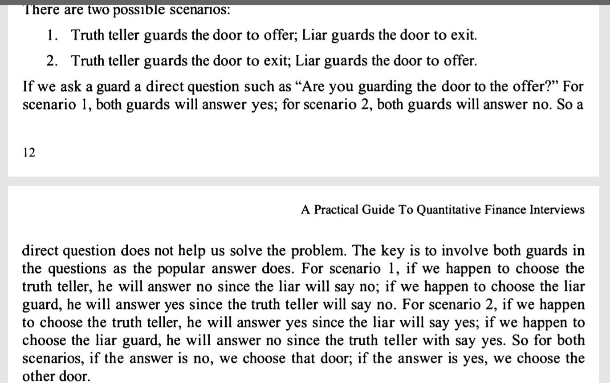

You are facing 2 doors.
one leads to job offer; another leads to exit
in front of either door is a guard.
1 guard always tells lies and the other always tells truth.
You can only ask one guard one yes/no question.
Assuming you do want to get the job offer, what question will you ask?

idea:
logically, g1 and g2 as guards:
assume g1 is the genuine guy, (doesnt matter if opposite)
the case will be:
the fact could be below possibilities:
case c1:
g1 JO
g2 E

case c2:
g1 E
g2 JO

q: The question to ask: is the door you looking after leading to job offer?
if c1 and ask g1, yes 
if c1 and ask g2, yes 

if c2 and ask g1, no 
if c1 and ask g2, no 

so I cannot tell difference.

Re-think about the question: will the other guard say that you are guarding the door to job offer?
if c1 and ask g1, no  
if c1 and ask g2, yes 
 
if c2 and ask g1, yes
if c1 and ask g2, no 

so looks the answer if yes is the other door, if no, it is the door the guard is looking after.

Solution:

answer: would the other guard say that you are guarding the door to offer?
- if answer is yes, choose the other door
- if answer is no, choose the door

