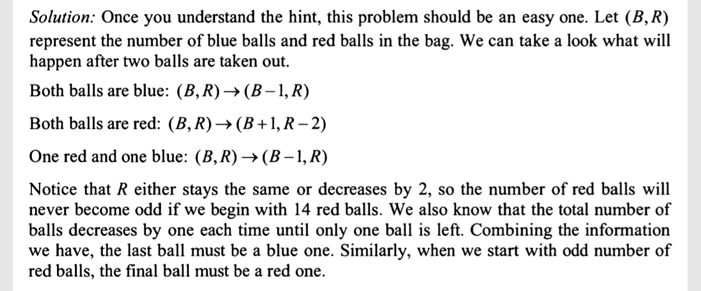

a bag has 20 blue balls and 14 red balls.
each time you take 2 random balls out. assume each ball has equal probability of being taken.
you dont put these 2 balls back. instead if both balls have the same color, you add a blue ball to the bag
if they have different color, you add a red ball to the bag. Assume that you have unlimited supply of blue and red balls.
if you keep on repeating process, 
what will be the color of the last ball left in the bag?
what is the bag has 20 blue and 13 red balls intead?

idea:
34 in total initially, 
prob of same colors is:
20/34 * 19/33 + 14/34 * 13/33 = approx 50.09%
prod of different color will be (1 - above)

repeating above unlimited times: I believe the last ball will be blue since more blue in the beginning and blue given
when same color.

Solution

