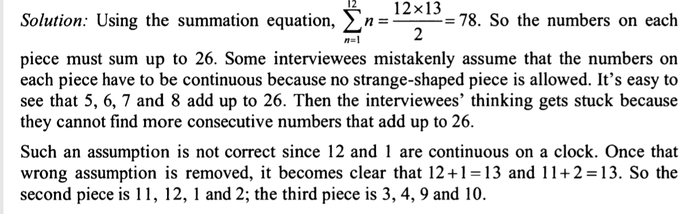

A clock (numbered 1-12 clockwise) fell off the wall and broke into 3 pieces. You find that the sums of the numbers on 
each piece are equal. what are the numbers on each piece? (no strange shaped piece is allowed)

Idea:
1 2 3 4 [5 6 7 8] 9 10 11 12
5 6 7 8
1 2 11 12
3 4 9 10

Solution

