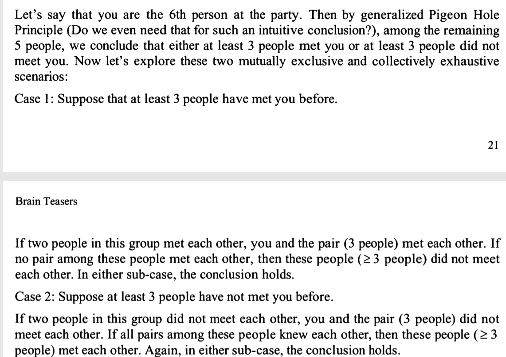

Show me that, if there are 6 ppl at a party, then either at least 3 ppl met each other before the party, or at least
3 ppl were strangers before the party.

idea:
2 holes, know and strange
6 ppl, as per generalised pigeon hole, 
n holes, mn + 1 pigeons, at least m+1 pigeons share holes. 
so, n=2, m=2.5 then at least 3.5 ppl either know or strange

Solution: more or less same with my idea

