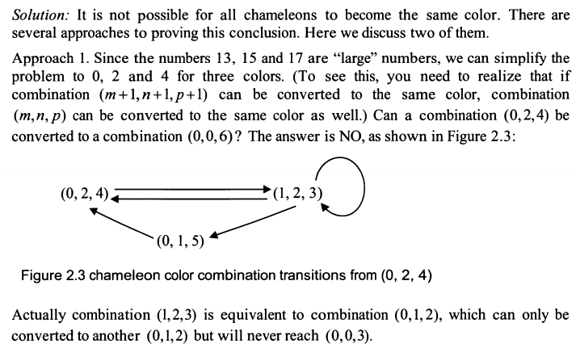

A remote island has 3 types of chameleons (变色龙) with the following populations:
13 red
15 green
17 blue
each time 2 with dif colors meet, they would change color to third color.
i.e if green meets red, they both change to blue.

Is it ever possible for all to become the same color? Why/why not?

Idea:
thinking of mod calculation.
when 13 red meet with others, they change to third color.
lets say, all becomes blue. now:
Red  |  Green |  Blue  |
13      13+2    17      
0       2       13+13+17=43
2+2=4   0       43-2=41

so never possible same color, always looping because they initially dif number    

