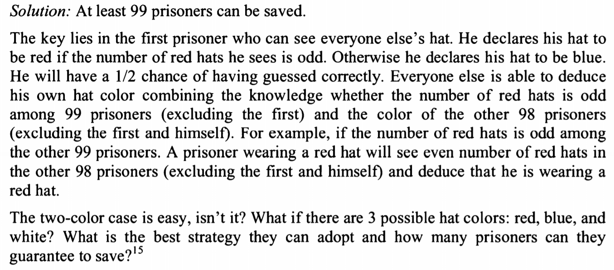
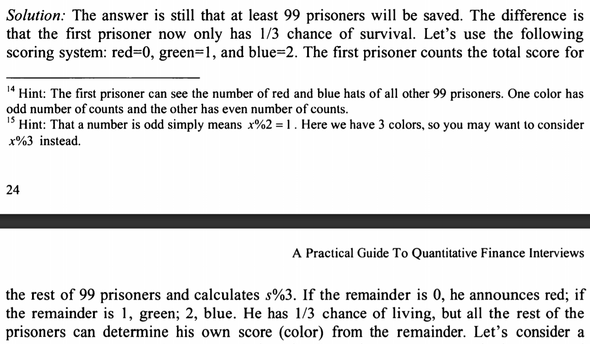

100 prisoners are given the change to be set free tomorrow.
they are all told that each will be given a red/blue hat. each prisoner can see others but not his own.
the hat colors are assigned randomly. and once the hats are placed on head they cannot communicate with on another.
the prisoners will be called out in random order and they will be called out to guess the color of his hat. 
each prisoner declares the color of his hat so that everyone else can hear it. 
If a prisoner is correct, set free, otherwise he is executed.

they are given night before to discuss a strategy to save as many as possible.
what is the best strategy?

Idea & solution:
100 prisoners, 
1st prison: if for all others, red hat number is odd, declare red, otherwise blue. -> 1/2 survive.

if 1st is correct, then 1 red + odd number red (inc 2nd prison)
now 2nd - 100th prison: if all remaining (98 - 0 left), if red hat number is odd, declare blue, otherwise red

more details:

