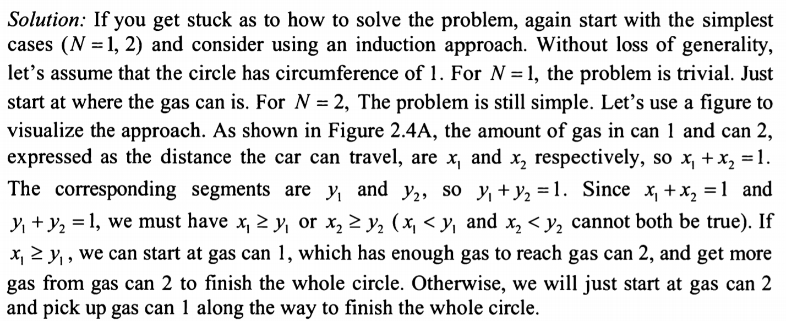
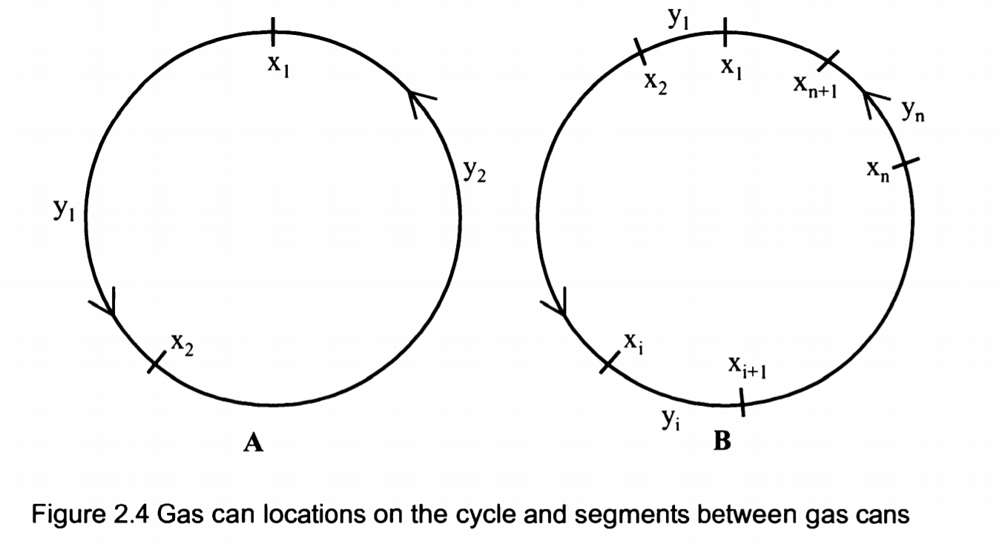
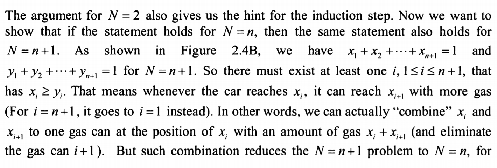
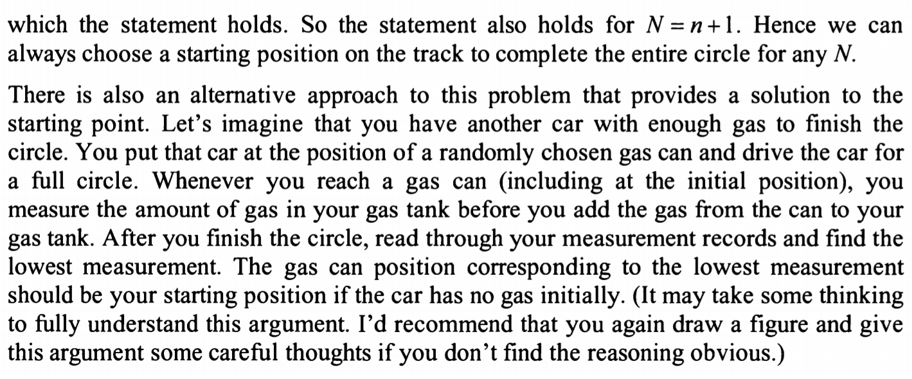

Suppose you are on a one-way circular race track. there are N gas cans randomly placed on different locations of the
track and the total sum of the gas in these cans is enough for your car to run exactly one circle.
Assume your car has no gas in the gas tank initially but you can put your car at any location on the track and you can 
pick up the gas cans along the way to fill in your gas tank. can you always choose a starting position on the track so that
your car can complete the entire circle?

idea:
d is distance, s is gas can storage
f(1): d=1 s=1, then pick s no doubt
f(2): d: d1 1-d1, s: s1 1-s1, then if d1>s1, pick the location of 1-s1 gas can, else s1
f(3): d: d1 d2 1-(d1+d2), s: s1, s2, 1-(s1+s2), effectively similar to f(2), same logic should apply. 
and then beween d1,d2, f(1) logic should apply

therefore we can infer that there is always a starting position on the tract that my car can complete the entire circle.

Solution:

