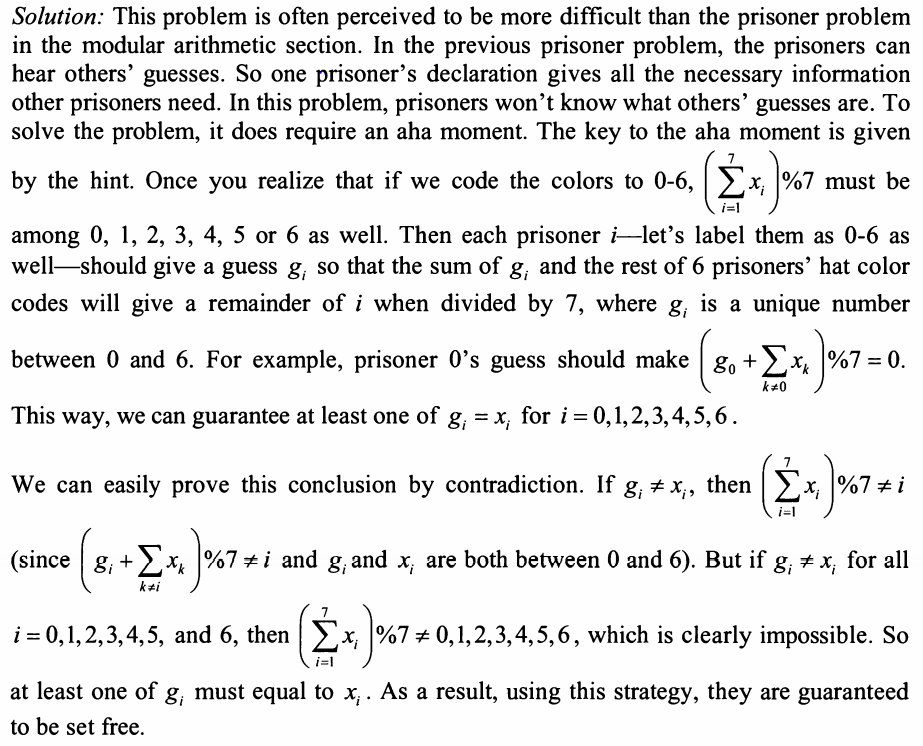

7 prisoner are given the chance to be set free tomororw. an executioner will
put a hat on each prisoner's head. each hat can be 1 of 7 colors of the rainbow
and the hat colors are assigned completely at the executioner's discretion.
each prisoner can see the hat colors of the other 6 prisoners. but not his own
they cannot communicate with others. then each prisoner writes down his guess
of his own hat color. if at least 1 prisoner correctly guesses the color of his
hat, they all will be set free immediately. otherwise they will be executed.

they are given a night to come up with a strategy. is there a strategy that
they can guarantee that they will be set free?

idea:
p1 - p7
c1 - c7

As 7 colors assigned randomly to p, then again we need a way to pass info to all prisons.

then think from small.
try strategy: if p1 guesses the most colors other p having, this is a sign for others to
all guess that color, which will ensure that at least 1 p can guess it correct.
if all other colors are diff, p1 can guess any one from others and all others should guess that color.
again this should ensure at least 1 p can get it correct. 

