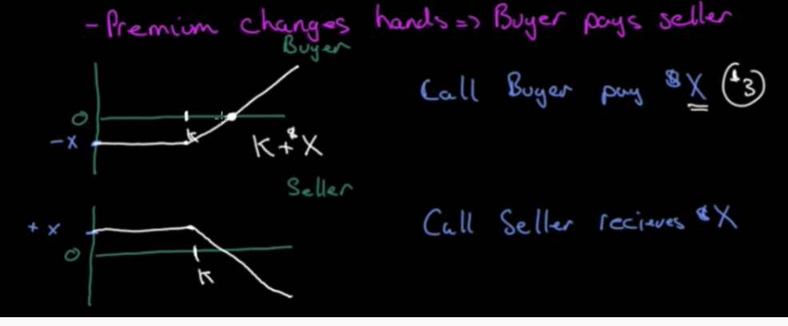
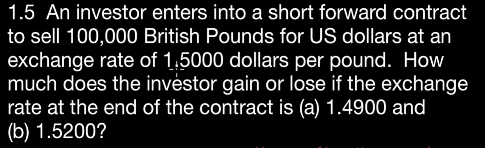
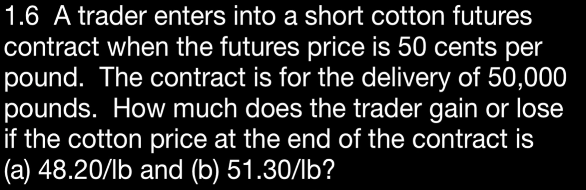
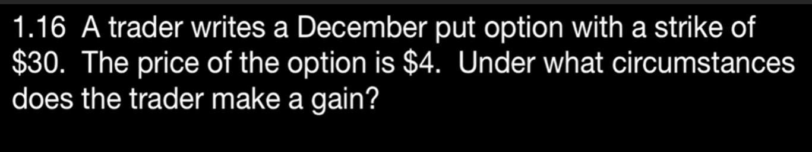
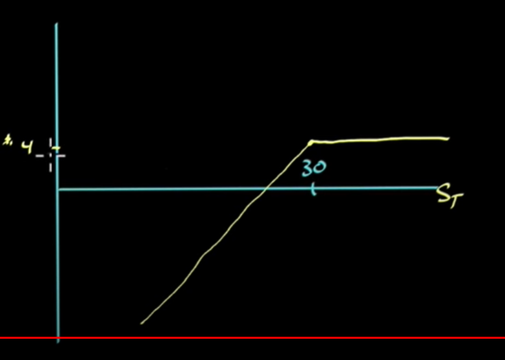
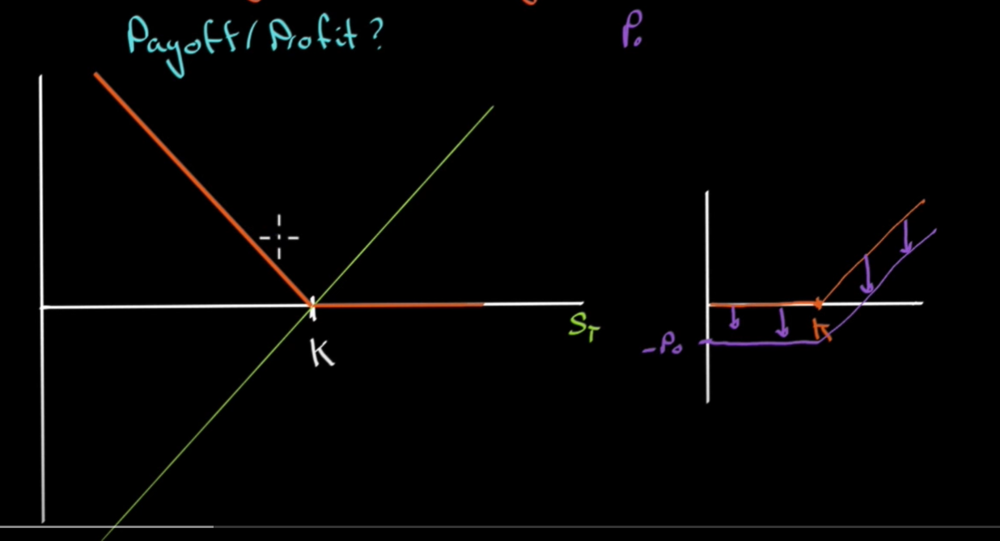
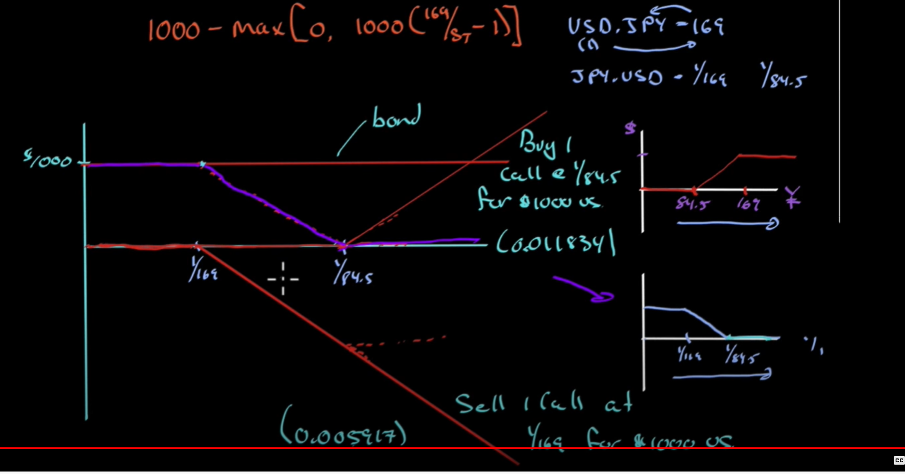

# introduction:
Derivatives: financial instrument whose value depends on the value of underlying variable: 
i.e. real asset / financial asset: index/event 

## Exchange traded vs OTC
exchange traded:
buyer -> [Clearing house] <- seller , hence eliminates counter party risk
- highly regulated

## OTC:
buyer <-> seller
OR
buyer -> [Central counter party] <- seller
- less regulated

~ 12 * larger than exchange traded in terms of principal underlying assets.

## Forwards
- no cost to enter
- not creating new money
## Options
- American - anytime exercise (most exchanged options)
- European - last day exercise only (most OTC options)

option has premium: buyer pays seller

call buyer pay $x
call seller receivers $x

 

for buyer:
- limited loss
- unlimited gain

for seller:
- limited gain (up to premium)
- unlimited loss

that's terrible for seller.

## Type of traders
1. Hedgers: reduce/eliminate risk: i.e. lock-in price
2. Speculators: take on risk (can be engineered), make a price bet (directional) (even no direction)
3. Arbitrageurs: riskless profit, take advantage of mispriced assets (either cross time or place)

## Question 
### 1.3

### 1.5

(a) 1.5000-1.49000=0.0100 (called 100 pips) * 100,000 = $1k
(b) 1.5000-1.52000=-0.0200 * 100,000 = -$2k

the payoff will always be in the ccy of the 2nd of the pair: i.e. GBPUSD, in this case USD.

### 1.6

(50-48.20)*50000 = $900
(50-51.30)*50000 = $-650

### 1.16

a trader writes option meaning they get 4 dollars, (Traders who write an option receive a fee, or premium, in exchange 
for giving the option buyer the right to buy or sell shares at specific price and date.)
so over $26 trader will gain.

### 1.22
long forward + long put at same K
payoff / profit

### 1.23
Index currency option notes

if USDJPY > 169, bond pays $1000
[84.5 , 169] bond pays 1000 - max[0, 1000*(169/St-1)]
-,84.5), bond pays nothing

show that the icon can be represented at a bond and 2 options
think from call perspective by reverse the currency to be USD based so that the shape flipped back to call option payoff.

