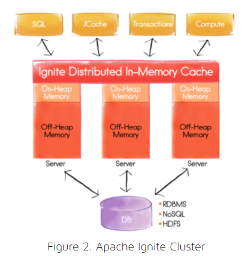

#Introduction
Apache Ignite is an open source memory-centric distributed platform. We can use it as a database, a caching system or 
for the in-memory data processing.

The platform uses memory as a storage layer, therefore has impressive performance rate. Simply put, this is one of the 
fastest atomic data processing platforms currently in production use.

#Memory Arch
The platform is based on Durable Memory Architecture. This enables to store and process the data both on disk and in memory. 
It increases the performance by using the RAM resources of the cluster effectively.

The data in memory and on the disk has the same binary representation. This means no additional conversion of the data 
while moving from one layer to another.

Durable memory architecture splits into fixed-size blocks called pages. Pages are stored outside of Java heap and 
organized in a RAM. It has a unique identifier: FullPageId.

Pages interact with the memory using the PageMemory abstraction.

It helps to read, write a page, also to allocate a page id. Inside the memory, Ignite associates pages with Memory Buffers.

#Clustering
 Clustering forms the basis for any distributed system. So, we will discuss how clustering can be configured in Apache 
 Ignite with a particular focus on auto-discovery.
 
Here we define clustering as the ability to start multiple nodes in a cluster 
 deployment and for those nodes to discover each other and work together. In Apache Ignite, nodes can automatically 
 discover each other in any environment. This environment could be a public cloud such as Amazon Web Services or 
 OpenStack, a private cloud, a hybrid cloud, or even a personal computer such as a desktop or a laptop. Apache Ignite 
 can also run in containerized environments, such as Docker. Apache Ignite supports all of these environments by default.
 
 
#Memory Pages
A Page can have the following states:

- Unloaded – no page buffer loaded in memory
- Clear – the page buffer is loaded and synchronized with the data on disk
- Durty – the page buffer holds a data which is different from the one in disk
- Dirty in checkpoint – there is another modification starts before the first one persists to disk. Here a checkpoint 
starts and PageMemory keeps two memory buffers for each Page.
Durable memory allocates local a memory segment called Data Region. By default, it has a capacity of 20% of the cluster 
memory. Multiple regions configuration allows keeping the usable data in a memory.

The maximum capacity of the region is a Memory Segment. It's a physical memory or a continuous byte array.
To avoid memory fragmentations, a single page holds multiple key-value entries. Every new entry will be added to 
the most optimal page. If the key-value pair size exceeds the maximum capacity of the page, Ignite stores the data in 
more than one page. The same logic applies to updating the data.

SQL and cache indexes are stored in structures known as B+ Trees. Cache keys are ordered by their key values.

#Lifecycle
Each Ignite node runs on a single JVM instance. However, it's possible to configure to have multiple Ignite nodes 
running in a single JVM process.

Lifecycle event types:

BEFORE_NODE_START – before the Ignite node startup
AFTER_NODE_START – fires just after the Ignite node start
BEFORE_NODE_STOP – before initiating the node stop
AFTER_NODE_STOP – after the Ignite node stops
To start a default Ignite node:
```
Ignite ignite = Ignition.start();
```
Or from a configuration file:
```
Ignite ignite = Ignition.start("config/example-cache.xml");
```
In case we need more control over the initialization process, there is another way with the help of 
LifecycleBean interface:
```
public class CustomLifecycleBean implements LifecycleBean {
 
    @Override
    public void onLifecycleEvent(LifecycleEventType lifecycleEventType) 
      throws IgniteException {
 
        if(lifecycleEventType == LifecycleEventType.AFTER_NODE_START) {
            // ...
        }
    }
}
```
#In-Memory Data Grid
Ignite data grid is a distributed key-value storage, very familiar to partitioned HashMap. It is horizontally scaled. 
This means more cluster nodes we add, more data is cached or stored in memory.

It can provide significant performance improvement to the 3rd party software, like NoSql, RDMS databases as an 
additional layer for caching.

##Caching Support
The data access API is based on JCache JSR 107 specification.

As an example, let's create a cache using a template configuration:
```java
IgniteCache<Employee, Integer> cache = ignite.getOrCreateCache("baeldingCache");
```

Let's see what's happening here for more details. First, Ignite finds the memory region where the cache stored.
Then, the B+ tree index Page will be located based on the key hash code. If the index exists, a data Page of the 
corresponding key will be located. 
When the index is NULL, the platform creates the new data entry by using the given key.
```java
cache.put(1, new Employee(1, "John", true));
cache.put(2, new Employee(2, "Anna", false));
cache.put(3, new Employee(3, "George", true));
```

Again, the durable memory will look for the memory region where the cache belongs. Based on the cache key, the index 
page will be located in a B+ tree structure.

When the index page doesn't exist, a new one is requested and added to the tree.

Next, a data page is assigning to the index page.

To read the employee from the cache, we just use the key value:
```java

Employee employee = cache.get(1);
```
##Streaming Support
In memory data streaming provides an alternative approach for the disk and file system based data processing 
applications. The Streaming API splits the high load data flow into multiple stages and routes them for processing.

We can modify our example and stream the data from the file. First, we define a data streamer:

```java
IgniteDataStreamer<Integer, Employee> streamer = ignite.dataStreamer(cache.getName());
```

Next, we can register a stream transformer to mark the received employees as employed:

```java
streamer.receiver(StreamTransformer.from((e, arg) -> {
    Employee employee = e.getValue();
    employee.setEmployed(true);
    e.setValue(employee);
    return employee;
}));
```

As a final step, we iterate over the employees.txt file lines and convert them into Java objects:

```java
Path path = Paths.get(IgniteStream.class.getResource("employees.txt").toURI());
Gson gson = new Gson();
Files.lines(path)
  .forEach(l -> streamer.addData(
    employee.getId(), 
    gson.fromJson(l, Employee.class)));
```

With the use of streamer.addData() put the employee objects into the stream.


#SQL Support
The platform provides memory-centric, fault-tolerant SQL database.

We can connect either with pure SQL API or with JDBC. SQL syntax here is ANSI-99, so all the standard aggregation 
functions in the queries, DML, DDL language operations are supported.

##JDBC
To get more practical, let's create a table of employees and add some data to it.  
For that purpose, we register a JDBC driver and open a connection as a next step:
```java
Class.forName("org.apache.ignite.IgniteJdbcThinDriver");
Connection conn = DriverManager.getConnection("jdbc:ignite:thin://127.0.0.1/");

sql.executeUpdate("CREATE TABLE Employee (" +
  " id LONG PRIMARY KEY, name VARCHAR, isEmployed tinyint(1)) " +
  " WITH \"template=replicated\"");
```
After the WITH keyword, we can set the cache configuration template. Here we use the REPLICATED. By default, 
the template mode is PARTITIONED. To specify the number of copies of the data we can also specify BACKUPS parameter 
here, which is 0 by default.
Then, let's add up some data by using INSERT DML statement:
```java
PreparedStatement sql = conn.prepareStatement(
  "INSERT INTO Employee (id, name, isEmployed) VALUES (?, ?, ?)");

sql.setLong(1, 1);
sql.setString(2, "James");
sql.setBoolean(3, true);
sql.executeUpdate();

// then select to view result
ResultSet rs 
  = sql.executeQuery("SELECT e.name, e.isEmployed " 
    + " FROM Employee e " 
    + " WHERE e.isEmployed = TRUE ")
```
##Query the Objects
It's also possible to perform a query over Java objects stored in the cache. Ignite treats Java object as a separate 
SQL record:
```java
IgniteCache<Integer, Employee> cache = ignite.cache("baeldungCache");

SqlFieldsQuery sql = new SqlFieldsQuery(
  "select name from Employee where isEmployed = 'true'");

QueryCursor<List<?>> cursor = cache.query(sql);

for (List<?> row : cursor) {
    // do something with the row
}
```


#Data Grid
In Apache Ignite, a Data Grid can be thought of as a distributed Key-Value (K-V) store or a distributed HashMap.
we can see an example Apache Ignite cluster, where the entire data set is held in the Ignite Distributed In-Memory Cache



